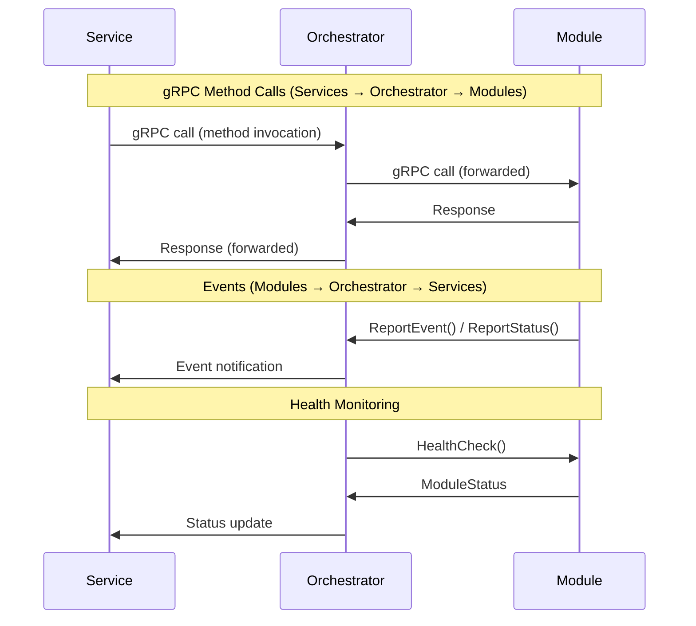

# gRPC Protocol Design

## Core Communication Protocol Design

Based on the architecture requirements, here's the high-level design for the gRPC communication protocol:

### **Communication Pattern**
- **Services as Clients**: Services make RPC calls through the orchestrator
- **Orchestrator as Broker**: Forwards calls to modules and events to services
- **Modules as Servers**: Each module runs a gRPC server on assigned port
- **Bidirectional Communication**: Control commands (service→orchestrator→module) + status/events (module→orchestrator→service)

### **Communication Flow**



**Key Principles:**
- **Services** sit in front of orchestrator and initiate actions
- **Modules** cannot depend on services - they only communicate with orchestrator
- **Orchestrator** acts as a broker, forwarding calls and events between services and modules

### **Core Services**

#### **1. ModuleService** (provided by each module)
**Purpose**: Module lifecycle, registration, and health management

**Key Operations**:
- `RegisterModule()` - Initial registration with capabilities
- `HealthCheck()` - Regular health monitoring
- `Configure()` - Runtime configuration updates
- `Shutdown()` - Graceful shutdown coordination

#### **2. EntityService** (provided by each module)
**Purpose**: Entity lifecycle management within the module

**Key Operations**:
- `CreateEntity()` - Create new entity instances
- `ConfigureEntity()` - Update entity configuration
- `GetEntityStatus()` - Query entity state and metrics
- `DestroyEntity()` - Clean up entity resources
- `ListEntities()` - Enumerate active entities

#### **3. PipelineService** (provided by each module)
**Purpose**: Pipeline/graph operations and media flow management

**Key Operations**:
- `ConnectEntities()` - Establish connections between entities
- `DisconnectEntities()` - Remove connections
- `StartFlow()` - Begin media flow through pipeline
- `StopFlow()` - Stop media flow
- `GetFlowStatus()` - Query flow state and metrics
- `AdjustQuality()` - Dynamic quality/bitrate adjustments

#### **4. EventService** (provided by orchestrator)
**Purpose**: Receive events and status updates from modules

**Key Operations**:
- `ReportEvent()` - Module-to-orchestrator event notifications
- `ReportStatus()` - Periodic status updates
- `ReportMetrics()` - Performance and health metrics

## Key Interaction Patterns

### **1. Module Startup and Registration Flow**
1. Orchestrator discovers module via directory scan
2. Orchestrator starts module process with `GRPC_PORT` env var
3. Module starts gRPC server on assigned port
4. Orchestrator calls `RegisterModule()` → Module responds with `ModuleInfo` + capabilities
5. Module reports `STARTING` state initially
6. If module needs configuration, it reports `WAITING_FOR_CONFIG` state
7. Config service (via orchestrator) provides configuration if needed
8. Module reports `READY` state when fully initialized
9. Orchestrator calls `HealthCheck()` to verify module is ready

### **2. Entity Creation Flow**
1. Service determines need for entity (e.g., RTSP source)
2. Service calls orchestrator to find capable module via capability matching
3. Service calls orchestrator → orchestrator calls `EntityService.CreateEntity()` → Request: `entity_type`, `configuration` → Response: `EntityDefinition` with assigned ID
4. Module creates entity instance and returns status
5. Service calls orchestrator → orchestrator calls `ConfigureEntity()` if additional setup needed
6. Entity marked as `READY` for pipeline use

### **3. Pipeline Construction Flow**
1. Service requests pipeline creation from orchestrator
2. Orchestrator calculates optimal path (source → converters → target)
3. For each connection in path:
   a. Orchestrator calls `PipelineService.ConnectEntities()`
   b. Module validates compatibility and creates connection
   c. Module returns `Connection` with actual parameters
4. Orchestrator calls `StartFlow()` to begin media flow
5. Modules coordinate media transport (outside gRPC)
6. Orchestrator monitors flow via `GetFlowStatus()` and reports back to services

### **4. Health Monitoring Flow**
1. Orchestrator periodically calls `HealthCheck()` on each module
2. Modules report `ModuleStatus` + entity health
3. Modules proactively call `EventService.ReportEvent()` for issues
4. Orchestrator correlates health data and forwards events to services
5. Services can request orchestrator to trigger recovery actions
6. Failed modules are restarted, entities are recreated

### **5. Dynamic Configuration Flow**
1. Service determines configuration change needed (e.g., quality adjustment)
2. Service calls orchestrator → orchestrator calls `PipelineService.AdjustQuality()`
3. Module updates active flow parameters
4. Module calls `EventService.ReportStatus()` to confirm change
5. Orchestrator updates flow state and forwards status to services

## Design Strengths

- **Independence**: Modules run as separate processes with their own gRPC servers
- **Language Agnostic**: Any language can implement the gRPC services
- **Capability-Driven**: Dynamic discovery and matching of module capabilities
- **Extensible**: Easy to add new entity types and services
- **Resilient**: Built-in health monitoring and error reporting

## Communication Flow

1. **Bootstrap**: Orchestrator discovers and starts modules
2. **Registration**: Modules advertise their capabilities
3. **Entity Management**: Dynamic creation and configuration of entities
4. **Pipeline Construction**: Connecting entities to form media flows
5. **Runtime Management**: Health monitoring, quality adjustments, error handling

## Next Steps

The protocol is designed to be implemented incrementally:
1. Start with ModuleService for basic module lifecycle
2. Add EntityService for entity management
3. Implement PipelineService for media flows
4. Add EventService for comprehensive monitoring

This design balances simplicity with the flexibility needed for a complex multi-protocol video calling system.

## Core Message Types

### **Module Management Messages**
```
ModuleInfo {
  id: string
  name: string
  version: string
  description: string
  capabilities: ModuleCapabilities
  status: ModuleStatus
}

ModuleCapabilities {
  entity_types: [EntityType]      // VIDEO_SOURCE, VIDEO_SINK, CONVERTER, PROTOCOL
  supported_protocols: [string]   // rtsp, webrtc, hls, chromecast, etc.
  supported_codecs: [string]      // h264, vp8, opus, aac, etc.
  features: [string]             // transcoding, scaling, recording, etc.
}

ModuleStatus {
  state: ModuleState             // STARTING, READY, ERROR, STOPPING
  health: HealthStatus           // HEALTHY, DEGRADED, UNHEALTHY
  error_message: string
  last_heartbeat: timestamp
}
```

### **Entity-Specific Messages**

**Design Decision: Separate Audio/Video Entities**

Rather than having a single entity that handles "both" audio and video, we use separate entities for each media type. This means:

- A camera with microphone creates two entities: `camera_front_door_video` and `camera_front_door_audio`
- Each entity has exactly one `MediaType` (AUDIO or VIDEO)
- Each connection carries exactly one media type
- Modules can coordinate between related entities internally

**Benefits of this approach:**
- **Simpler connections**: Each connection has exactly one media type
- **Flexible routing**: Can route audio and video to different destinations independently
- **Easier capability matching**: Only need to match capabilities for the specific media type
- **More composable**: Can mix audio from one source with video from another
- **Consistent**: Audio-only sources (microphones) and video-only sources (screen capture) fit naturally

#### **Media Source Entities**
```
MediaSource {
  id: string
  name: string
  type: string                   // rtsp, usb, hls, file, etc.
  config: map<string, string>    // Plugin-specific configuration
  status: EntityStatus
  provides: EntityCapabilities
}
```

#### **Media Sink Entities**
```
MediaSink {
  id: string
  name: string
  type: string                   // chromecast, miracast, airplay, display, etc.
  config: map<string, string>    // Plugin-specific configuration
  status: EntityStatus
  requires: EntityCapabilities
}
```

#### **Protocol Entities**
```
Protocol {
  id: string
  name: string
  type: string                   // matrix, xmpp, webrtc, sip, etc.
  config: map<string, string>    // Plugin-specific configuration
  status: EntityStatus
  requiresAudio: EntityCapabilities
  requiresVideo: EntityCapabilities
}
```

#### **Converter Entities**
```
Converter {
  id: string
  name: string
  type: string                   // go2rtc, ffmpeg, gstreamer, etc.
  config: map<string, string>    // Plugin-specific configuration
  status: EntityStatus
  input: EntityCapabilities
  output: EntityCapabilities
}
```

### **Common Data Structures**
```
EntityStatus {
  state: EntityState             // CREATED, CONFIGURED, ACTIVE, ERROR, DESTROYED
  health: HealthStatus           // HEALTHY, DEGRADED, UNHEALTHY
  error_message: string
  active_connections: [string]   // Connection IDs
  metrics: map<string, MetricValue>
  created_at: timestamp
  last_updated: timestamp
}

EntityCapabilities {
  supported_protocols: [string]  // rtsp, webrtc, hls, etc.
  supported_codecs: [string]     // h264, vp8, opus, aac, etc.
  media_type: MediaType          // AUDIO, VIDEO
  properties: map<string, string> // Additional capability metadata
}

Resolution {
  width: int32
  height: int32
}

QualityProfile {
  resolution: Resolution
  bitrate: int32
  framerate: int32
  video_codec: string
  audio_codec: string
}

MediaFormat {
  container: string              // mp4, webm, ts, raw
  video_codec: string
  audio_codec: string
  resolution: Resolution
  bitrate: int32
}
```

### **Pipeline Management Messages**
```
Connection {
  id: string
  source_entity_id: string
  target_entity_id: string
  media_type: MediaType          // AUDIO, VIDEO
  transport_protocol: string     // rtsp, webrtc, hls, etc.
  quality: QualityProfile
  status: ConnectionStatus
  metrics: ConnectionMetrics
}

Flow {
  id: string
  name: string
  connections: [Connection]      // Ordered list forming the pipeline
  status: FlowStatus
  metrics: FlowMetrics
  created_at: timestamp
  started_at: timestamp
}

FlowStatus {
  state: FlowState              // INITIALIZING, ACTIVE, STOPPED, ERROR
  health: HealthStatus
  error_message: string
  bandwidth_usage: int64
  latency_ms: int32
}
```

### **Event and Status Messages**
```
Event {
  id: string
  type: EventType               // ENTITY_CREATED, FLOW_STARTED, ERROR, WARNING
  severity: EventSeverity       // INFO, WARNING, ERROR, CRITICAL
  source_module_id: string
  source_entity_id: string
  message: string
  details: map<string, string>
  timestamp: timestamp
}

StatusUpdate {
  module_id: string
  entity_id: string
  entity_status: EntityStatus
  timestamp: timestamp
}

Metrics {
  module_id: string
  entity_id: string
  flow_id: string
  connection_id: string
  metrics: map<string, MetricValue>
  timestamp: timestamp
}

MetricValue {
  oneof value {
    int64 int_value = 1;
    double double_value = 2;
    string string_value = 3;
    bool bool_value = 4;
  }
}
```